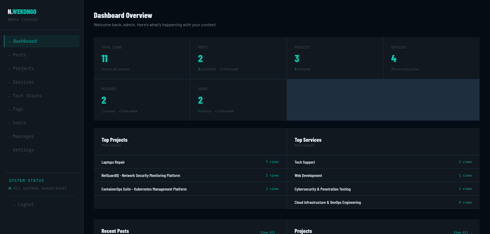
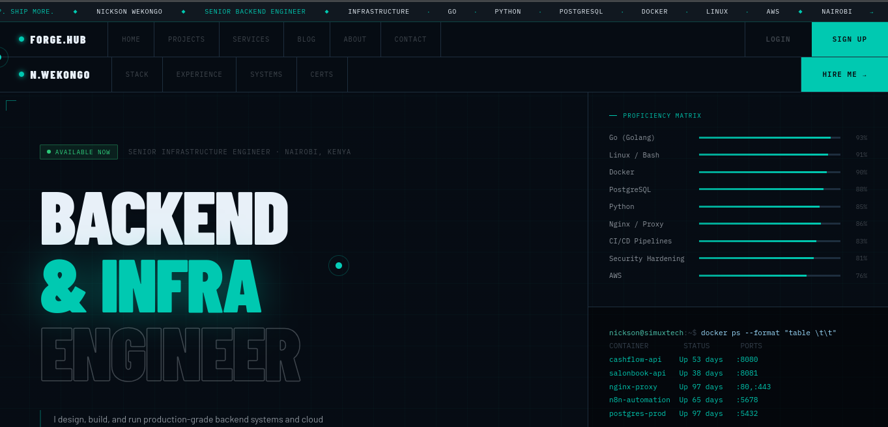
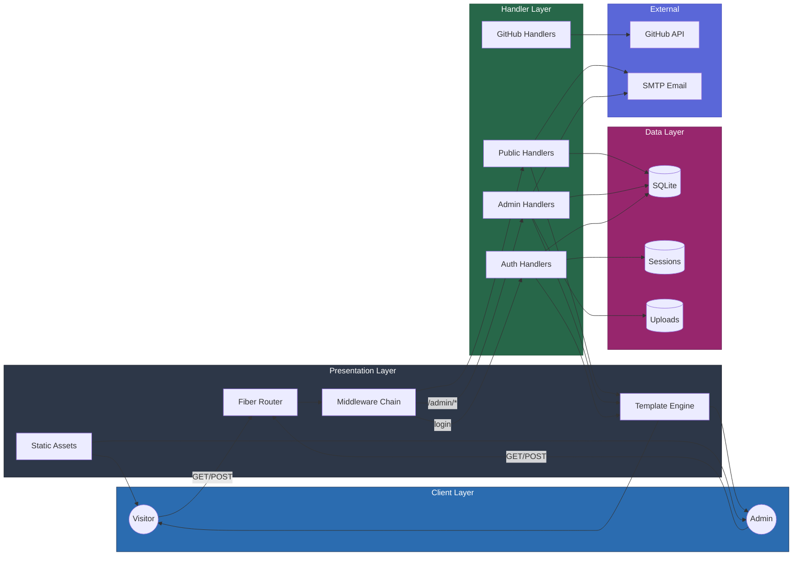

# 🛠️ Forge Hub

Forge Hub is a high-performance, production-ready professional portfolio and blogging platform designed for software engineers and creators. It provides a comprehensive suite of tools to showcase projects, publish technical blog posts, manage service offerings with tech stack associations, and handle client inquiries—all managed through a robust administrative dashboard.





## ✨ Key Features

### 🚀 Project Showcase
- **Deep Case Studies**: Beyond simple links, showcase projects with problem statements, solution approaches, key features, and measurable results.
- **Technical Metrics**: Track and display project performance metrics like uptime, response time, and scale.
- **Rich Metadata**: Categorize projects by difficulty, type (Open Source, Enterprise, etc.), and associate them with a dynamic tech stack.
- **SEO Ready**: Per-project meta descriptions, canonical URLs, and auto-tracked view counts.

### ✍️ Professional Blogging
- **Markdown Support**: Write technical articles using a clean Markdown-based system with syntax highlighting.
- **Taxonomy**: Organize content using categories and tags for better discoverability.
- **SEO Metadata**: Per-post meta descriptions, canonical URLs, Open Graph, Twitter Card, and JSON-LD structured data.

### 🛠️ Service Management
- **Service Catalog**: Create and manage service offerings with full descriptions, tech stack associations, and galleries.
- **Frontend Display**: Public services page with filtering, pagination, and individual service detail views.
- **Contact Integration**: Visitors can select relevant services when submitting the contact form.


## 🛡️ Admin Powerhouse
- **Full CMS**: Complete CRUD operations for Projects, Blog Posts, Services, Tech Stacks, and Tags.
- **Contact Management**: Inbox with read/unread status, search, pagination, and an integrated reply system.
- **User & Settings Management**: Manage user accounts, site configuration, and 2FA security.
- **Secure Access**: Protected by password authentication with TOTP two-factor authentication.

### 🌐 Integrations & Utilities
- **GitHub Stats**: Real-time integration of GitHub contribution graphs and repository stats.
- **Email System**: Auto-reply to contact form submissions, admin notifications for new messages, and admin reply via the dashboard.
- **Tech Stack Taxonomy**: Shared tech stack model associated with both projects and services.
- **Health Monitoring**: Built-in `/health` endpoint for container orchestration and uptime monitoring.

## 🏗️ Tech Stack

| Layer | Technology |
| :--- | :--- |
| **Language** | [Go (Golang) 1.23+](https://go.dev/) |
| **Web Framework** | [Fiber v2](https://gofiber.io/) |
| **Database** | [SQLite](https://www.sqlite.org/) via [GORM](https://gorm.io/) |
| **Session** | Cookie-based (fiber session store) |
| **Templating** | Go HTML/template with Fiber layout engine |
| **Frontend** | HTML5, CSS3, vanilla JavaScript |
| **Deployment** | Docker, Docker Compose |
| **Security** | bcrypt, TOTP 2FA (via pquerna/otp), UUID |

## 🚀 Getting Started

### Prerequisites
- Go 1.23+ (for local development)
- Docker & Docker Compose (for production deployment)

### Local Installation
1. **Clone the repository**
   ```bash
   git clone https://github.com/C9b3rD3vi1/forge.git
   cd forge
   ```

2. **Environment Setup**
   Copy `.env.example` to `.env` and fill in your values:
   ```bash
   cp .env.example .env
   ```
   ```env
   APP_PORT=3031
   DB_PATH=server.db
   SESSION_SECRET=change-me-to-a-random-string
   ADMIN_USERNAME=admin
   ADMIN_EMAIL=admin@example.com
   ADMIN_PASSWORD=admin123
   GITHUB_USERNAME=your-username
   SMTP_HOST=smtp.gmail.com
   SMTP_PORT=587
   SMTP_USER=your@email.com
   SMTP_PASSWORD=your-app-password
   TZ=Africa/Nairobi
   ```

3. **Run the application**
   ```bash
   go run main.go
   ```
   The server will start on `http://localhost:3031`.

### Docker Deployment (Recommended)
Forge Hub comes with a fully containerized setup.

1. **Build and Run**
   ```bash
   docker-compose up -d --build
   ```

2. **Verify Health**
   ```bash
   curl http://localhost:3031/health
   ```

## 🚢 Production Management

The project includes a comprehensive lifecycle management script `deploy.sh` to handle updates and maintenance.

### Deployment Lifecycle
```bash
chmod +x deploy.sh

# Full deployment (Pull latest, rebuild, and restart)
./deploy.sh deploy

# Restart the service
./deploy.sh restart

# Check container status and resource usage
./deploy.sh status

# View real-time logs
./deploy.sh logs 100
```

### Database Maintenance
Ensure your data is safe with built-in backup and restore capabilities:

```bash
# Backup the SQLite database
./deploy.sh backup

# Restore from a specific backup file
./deploy.sh restore
```

## 📂 Project Architecture

Forge Hub follows a **Modular Monolith Architecture**, designed for high efficiency and low latency.

### 🗺️ System Diagram


### ⚙️ Architectural Analysis

#### Request Lifecycle
1. **Entry**: HTTP request → Fiber Server.
2. **Middleware Chain**: `InjectGlobalData` (footer services, login state) → `DynamicLayoutMiddleware` (public/admin layout switch) → `RequireAdminAuth` (admin routes only).
3. **Routing**: Dispatch to specialized Handlers (Public, Admin, Auth, GitHub).
4. **Persistence**: Business logic → GORM → SQLite. Image/file uploads written to `/uploads`.
5. **Response**: Template Engine → HTML → Client. Static assets (`/static`, `/uploads`) served directly.

#### Key Technical Decisions
- **SQLite**: Simple, zero-config database — no external DB server required.
- **Server-Side Rendering**: Pure Go `html/template` rendering for maximum SEO and performance.
- **Defense-in-Depth**: bcrypt password hashing + TOTP 2FA for administrative security.
- **Async Email**: Email sends are non-blocking goroutines — the HTTP response is never blocked by SMTP.

### 🎨 Component Legend
| Color | Layer | Responsibility |
| :--- | :--- | :--- |
| **Blue** | Client | Browsers — Visitor and Admin users |
| **Dark Grey** | Presentation | Fiber Router, Middleware, Template Engine, Static Assets |
| **Green** | Handler | Business Logic — Public, Admin, Auth, GitHub Handlers |
| **Pink** | Data | SQLite persistence, Cookie Sessions, File Uploads |
| **Purple** | External | GitHub REST API integration, SMTP Email sending |

### 📂 Directory Structure
```text
.
├── auth/           # Authentication logic (login, TOTP 2FA, session management)
├── config/         # Session store, Redis connection test
├── database/       # DB initialization, auto-migration, seed data
├── handlers/       # Business logic for Public, Admin, and API routes
├── middleware/     # Auth guards, layout injection, global data middleware
├── models/         # GORM data models (Project, Post, Service, User, Settings, TechStack)
├── routes/         # Public and Admin route definitions
├── static/         # CSS, favicon, images, logos, site.webmanifest
├── templates/      # HTML templates (Admin panels, Public pages, Email templates)
├── uploads/        # User-uploaded images (icons, project/service images)
└── utils/          # Helper functions (SMTP email, image upload, GitHub API, HTML escaping)
```


## 🛡️ Security Note
Forge Hub implements:
- **Secure Password Storage**: Using `bcrypt` for hashing.
- **Session Isolation**: Managed via Redis.
- **Two-Factor Authentication**: Admin access requires TOTP verification.
- **Container Hardening**: Docker configuration includes `no-new-privileges` and limited logging to prevent disk exhaustion.

---
© 2026 Forge Hub. Built with 💙 using Go.
