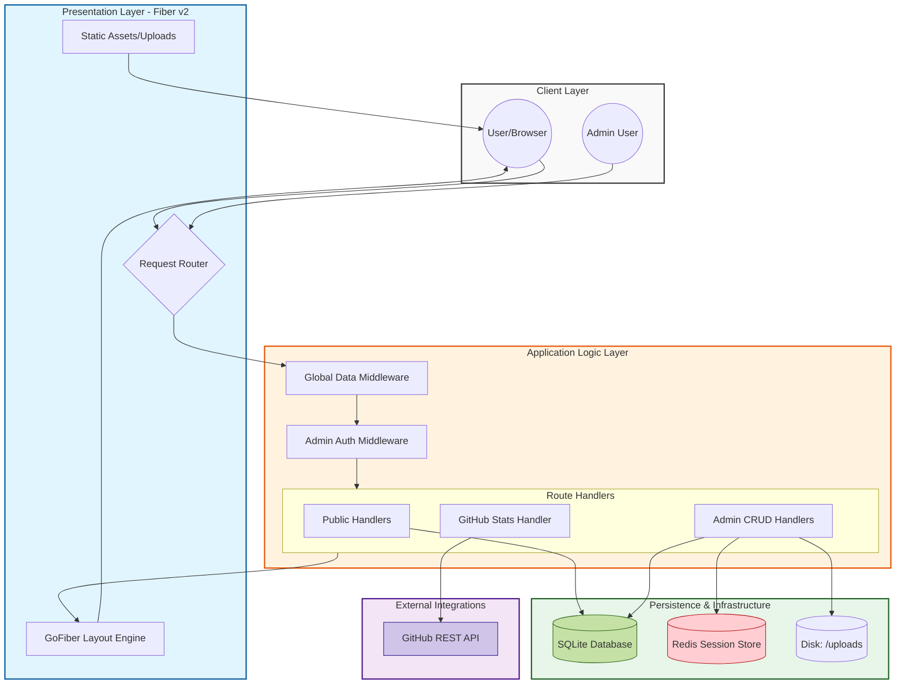

# 🛠️ Forge Hub

Forge Hub is a high-performance, production-ready professional portfolio and blogging platform designed for software engineers and creators. It provides a comprehensive suite of tools to showcase projects, document technical journeys via a blog, and manage service offerings—all managed through a robust administrative dashboard.


## ✨ Key Features

### 🚀 Project Showcase
- **Deep Case Studies**: Beyond simple links, showcase projects with problem statements, solution approaches, and detailed key features.
- **Technical Metrics**: Track and display project performance metrics like uptime, response time, and scale (Users Count).
- **Rich Metadata**: Categorize projects by difficulty, type (Open Source, Enterprise, etc.), and associate them with a dynamic tech stack.
- **Media Galleries**: Integrated support for cover images and project galleries.

### ✍️ Professional Blogging
- **Markdown Support**: Write technical articles using a clean Markdown-based system.
- **Taxonomy**: Organize content using categories and tags for better discoverability.
- **Dynamic Rendering**: Seamlessly render complex technical content for the end-user.

### 🛠️ Admin Powerhouse
- **Full CMS**: Complete CRUD operations for Projects, Blog Posts, and Services.
- **User Management**: Manage user accounts and administrative access.
- **Site Settings**: Configure global site metadata and behavior from the dashboard.
- **Secure Access**: Protected by multi-factor authentication (2FA) using TOTP and QR codes.

### 🌐 Integrations & Utilities
- **GitHub Stats**: Real-time integration of GitHub statistics and contribution graphs.
- **Contact System**: Integrated contact form with an email response system.
- **Health Monitoring**: Built-in `/health` endpoint for container orchestration and uptime monitoring.

## 🏗️ Tech Stack

| Layer | Technology |
| :--- | :--- |
| **Language** | [Go (Golang) 1.23+](https://go.dev/) |
| **Web Framework** | [Fiber v2](https://gofiber.io/) |
| **Database** | [SQLite](https://www.sqlite.org/) via [GORM](https://gorm.io/) |
| **Caching/Session** | [Redis](https://redis.io/) |
| **Frontend** | HTML5, CSS3, GoFiber-Layout |
| **Deployment** | Docker, Docker Compose |
| **Security** | bcrypt, TOTP (OTP), UUID |

## 🚀 Getting Started

### Prerequisites
- Go 1.23+ (for local development)
- Docker & Docker Compose (for production deployment)
- Redis (required for session management)

### Local Installation
1. **Clone the repository**
   ```bash
   git clone https://github.com/C9b3rD3vi1/forge.git
   cd forge
   ```

2. **Environment Setup**
   Create a `.env` file in the root directory:
   ```env
   APP_PORT=3031
   DB_PATH=./data/server.db
   # Add other necessary env vars (Redis, Mail server, etc.)
   ```

3. **Run the application**
   ```bash
   go run main.go
   ```
   The server will start on `http://localhost:3031`.

### Docker Deployment (Recommended)
Forge Hub comes with a fully containerized setup.

1. **Build and Run**
   ```bash
   docker-compose up -d --build
   ```

2. **Verify Health**
   ```bash
   curl http://localhost:3031/health
   ```

## 🚢 Production Management

The project includes a comprehensive lifecycle management script `deploy.sh` to handle updates and maintenance.

### Deployment Lifecycle
```bash
chmod +x deploy.sh

# Full deployment (Pull latest, rebuild, and restart)
./deploy.sh deploy

# Restart the service
./deploy.sh restart

# Check container status and resource usage
./deploy.sh status

# View real-time logs
./deploy.sh logs 100
```

### Database Maintenance
Ensure your data is safe with built-in backup and restore capabilities:

```bash
# Backup the SQLite database
./deploy.sh backup

# Restore from a specific backup file
./deploy.sh restore
```

## 📂 Project Architecture

Forge Hub follows a **Modular Monolith Architecture**, designed for high efficiency and low latency.

### 🗺️ System Diagram


### ⚙️ Architectural Analysis

#### Request Lifecycle
1. **Entry**: HTTP request $\rightarrow$ Fiber Server.
2. **Middleware**: `InjectGlobalData` $\rightarrow$ `DynamicLayoutMiddleware` $\rightarrow$ `RequireAdminAuth` (if applicable).
3. **Routing**: Dispatch to specialized Handlers.
4. **Persistence**: Business logic $\rightarrow$ GORM $\rightarrow$ SQLite (Disk) / Redis (Session).
5. **Response**: Template Engine $\rightarrow$ HTML $\rightarrow$ Client.

#### Key Technical Decisions
- **SQLite with WAL**: Optimized for high-read performance and simple portability.
- **Defense-in-Depth**: Combination of `bcrypt` hashing and TOTP 2FA for administrative security.
- **SSR Architecture**: Pure server-side rendering for maximum SEO and speed.

### 🎨 Component Legend
| Color | Layer | Responsibility |
| :--- | :--- | :--- |
| **Blue** | Presentation | HTTP Routing & HTML Rendering |
| **Orange** | Logic | Auth Guards & Business Logic |
| **Green** | Data | SQLite Persistence & Redis Sessioning |
| **Purple** | External | Third-party API Integrations |

### 📂 Directory Structure
```text
.
├── auth/           # Authentication logic (JWT, OTP, Admin Auth)
├── config/         # Session and Redis configurations
├── database/       # DB initialization and migrations
├── handlers/       # Business logic for Public and Admin routes
├── middleware/     # Auth guards, layout injection, and global data
├── models/         # GORM data models (Project, Post, User, Settings)
├── routes/         # Route definitions for the application
├── static/         # CSS, Images, and client-side assets
├── templates/      # HTML templates (Admin and Public)
└── utils/          # Helper functions (Mail, Hashing, GitHub API)
```


## 🛡️ Security Note
Forge Hub implements:
- **Secure Password Storage**: Using `bcrypt` for hashing.
- **Session Isolation**: Managed via Redis.
- **Two-Factor Authentication**: Admin access requires TOTP verification.
- **Container Hardening**: Docker configuration includes `no-new-privileges` and limited logging to prevent disk exhaustion.

---
© 2026 Forge Hub. Built with 💙 using Go.
