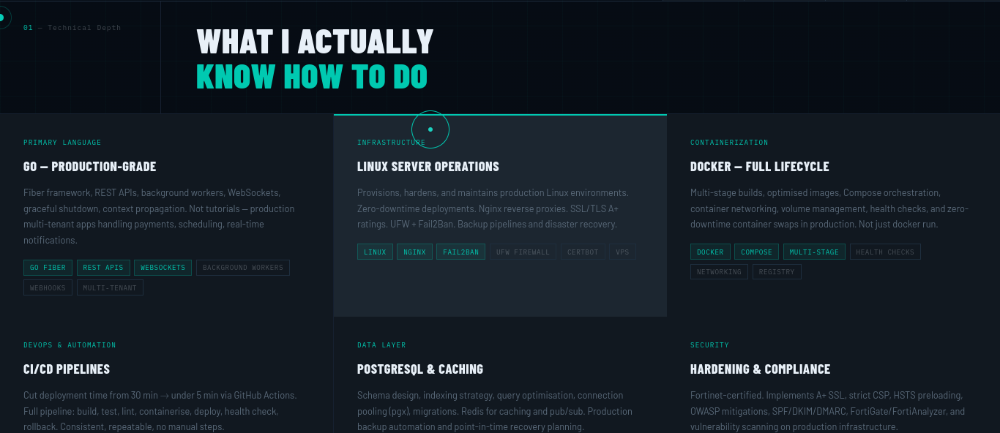

Forge





## Projects struct sample code

```go

type Projects struct {
    ID          uint      `gorm:"primaryKey"`
    Title       string    `gorm:"not null"`
    Slug        string    `gorm:"uniqueIndex;not null"`
    Description string    `gorm:"type:text"`
    
    // Enhanced content fields
    LongDescription string    `gorm:"type:text"`           // Detailed project story
    ProblemStatement string   `gorm:"type:text"`           // What problem does it solve?
    SolutionApproach string   `gorm:"type:text"`           // How does it solve it?
    KeyFeatures      string   `gorm:"type:text"`           // JSON array of features
    
    // Media
    ImageURL    string    `gorm:"type:text"`               // project cover image
    Gallery     string    `gorm:"type:text"`               // JSON array of additional images
    
    // Links
    Link        string    `gorm:"type:text"`               // primary link (live demo)
    GithubLink  string    `gorm:"type:text"`               // GitHub repository
    DemoLink    string    `gorm:"type:text"`               // Video demo URL
    DocsLink    string    `gorm:"type:text"`               // Documentation link
    
    // Categorization
    Category    string    `gorm:"size:100"`                // e.g. Cybersecurity, SaaS, Mobile, AI
    Difficulty  string    `gorm:"size:50;default:'intermediate'"` // beginner, intermediate, advanced
    ProjectType string    `gorm:"size:100"`                // Open Source, Enterprise, Personal, Client Work
    
    // Tags & Metadata
    Tags        string    `gorm:"type:text"`               // comma-separated list
    Featured    bool      `gorm:"default:false"`           // highlight in frontend
    Published   bool      `gorm:"default:true"`            // control visibility
    
    // Project Stats & Metrics
    CompletionDate *time.Time `gorm:"type:timestamp"`      // When project was completed
    DevelopmentTime string    `gorm:"size:50"`             // e.g., "3 months", "6 weeks"
    TeamSize       int       `gorm:"default:1"`            // Number of people involved
    LinesOfCode    string    `gorm:"size:100"`             // e.g., "10,000+", "5K LOC"
    
    // Performance Metrics
    Uptime      string    `gorm:"size:50"`                 // e.g., "99.9%"
    ResponseTime string   `gorm:"size:50"`                 // e.g., "200ms"
    UsersCount   string   `gorm:"size:50"`                 // e.g., "10K+", "500 monthly"
    
    // Relationships
    TechStacks []TechStack `gorm:"many2many:project_techstacks;"`
    
    // Timeline
    CreatedAt   time.Time
    UpdatedAt   time.Time
    StartedAt   *time.Time `gorm:"type:timestamp"`         // When development started
    
    Status      string    `gorm:"size:50;default:'completed'"` // planned, in-progress, completed, maintenance
}

```


## Web link
https://c9b3rd3vi1.simuxtech.com/
